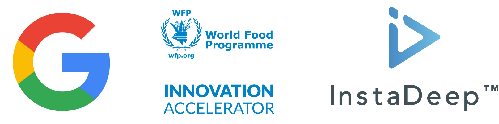

Disclaimer and Personal Statements of Tech Transfers from USA to PRC!

U.S. EAR restricts AI exports (e.g., model weights >10^25 FLOP, ECCN 4E091) to PRC/Entity List.
Check license needs: bis.doc.gov/ear. Report issues to compliance.

Even if not controlled, I protest unauthorized sharing—protect U.S. security, in accordance with my rights to 1st Amendment.

# SKAI

SKAI is a machine learning based tool for performing automatic building damage assessments on aerial imagery of disaster sites.

If you are working in the disaster response space and/or are interested in using SKAI, please reach out to the developers at [skai-developers@googlegroups.com](mailto:skai-developers@googlegroups.com).

## Background

A humanitarian disaster such as an earthquake, hurricane, or wildfire is a highly disruptive event that affects a region and people in complex ways. Disaster assessment is the process of understanding, quantifying, and locating these harmful effects, in order to provide crisis responders with situation awareness and help them plan rescue and recovery activities.

One predominant type of disaster assessment is identifying all buildings that were damaged or destroyed in a disaster. This helps estimate how much of the population is unsheltered or possibly trapped in rubble, or how much it will cost to rebuild a neighborhood.

SKAI uses machine learning and aerial imagery to automatically identify the locations of damaged buildings in a disaster region. This significantly speeds up damage assessment turn-around times and lowers labor costs. Model-generated assessments match expert generated assessments on between 85% and 98% of buildings assessed in many past disasters ranging from hurricanes to wildfires.

For more information, please refer to our [NeurIPS workshop paper](https://arxiv.org/abs/2011.14004) and our [blog post](https://ai.googleblog.com/2020/06/machine-learning-based-damage.html).

## Setup

Please see detailed setup instructions [here](setup.md).

## Using SKAI

Please see detailed instructions [here](assessment_instructions.md).

## Acknowledgments

This software was developed in collaboration with the following organizations:

### United Nations World Food Program (WFP) Innovation Accelerator

The WFP Innovation Accelerator identifies, supports and scales high potential solutions to hunger worldwide. The Innovation Accelerator supports WFP innovators and external start-ups and companies through financial support, access to a network of experts and a global field reach.

### InstaDeep AI for Social Good (AI4SG) team

[InstaDeep](https://www.instadeep.com/)'s AI for Social Good (AI4SG) team utilizes the company's expertise in AI research and engineering to create technologies aimed at improving human welfare and enhancing global well-being.

